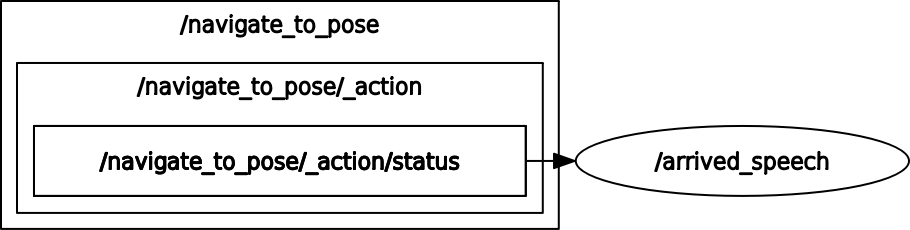

# announcement_of_goal_arrival
### Node and Topic

## Dependency
```
$ sudo apt install speech-dispatcher
```
## Setup
```
$ cd ~/ros2_ws/src  #Go to ros workspace
$ git clone https://github.com/iHaruruki/announcement_of_goal_arrival.git #clone this package
$ cd ~/ros2_ws
$ colcon build --symlink-install
$ source install/setup.bash
```

## Usage
```
$ ros2 run announcement_of_goal_arrival arrived_speech_node
```
### For debugging
* status: 4 indicates `STATUS_SUCCEEDED`
* --once: Send only once
If you change --once to -r 1, the sound will continue.
* -r 1: Continually issues messages at 1 Hz, useful for continuous testing of arrival detection nodes.
```
ros2 topic pub \
  /navigate_to_pose/_action/status \
  action_msgs/msg/GoalStatusArray \
  "{status_list:
    [
      {
        goal_info:
          {
            stamp:    {sec: 0, nanosec: 0},
            goal_id:  {uuid: [0,0,0,0,0,0,0,0,0,0,0,0,0,0,0,1]}
          },
        status: 4
      }
    ]
  }" \
  --once
```
## License
## Authors

## References
[How to use aplay and spd-say command in Linux](https://www.geeksforgeeks.org/how-to-use-aplay-and-spd-say-command-in-linux/)
